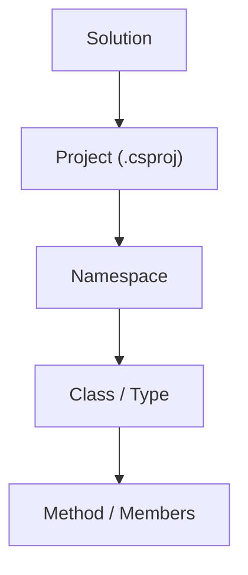

-# CSharpBasics — Beginner C# Examples

This small sample demonstrates core C# program structure and concepts for a new developer.

## Setup (for absolute beginners)

Follow these steps after you open the `CSharpBasics` folder in VS Code.

- Install the Markdown preview extension (GUI):
	1. Open the **Extensions** view (left sidebar) or press `Ctrl+Shift+X`.
	2. Search for **Markdown Preview Enhanced** and click **Install** (extension id: `shd101wyy.markdown-preview-enhanced`).
- Install the extension via command line (if you have `code` available):

```powershell
code --install-extension shd101wyy.markdown-preview-enhanced
```

- Preview the `README.md` with Markdown Preview Enhanced:
	1. Open `README.md` in the editor.
	2. Open the Command Palette with `Ctrl+Shift+P` and run **Markdown Preview Enhanced: Open Preview to the Side**.
	3. The preview will render the Mermaid diagram and let you scroll/inspect the document.

- Quick note: VS Code also has a built-in Markdown preview (`Ctrl+Shift+V`), but we recommend **Markdown Preview Enhanced** for better Mermaid support and exports.

## How to run the console app

You can run the sample in two common ways: the command line (PowerShell / CMD) or via a VS Code launch profile (debugger). Both are shown below.

1) Run from the command line (PowerShell)

Open the integrated terminal (`Ctrl+``) or a separate PowerShell, then run:

```powershell
cd C:\Users\louis\Desktop\CoreJumps
dotnet run --project CSharpBasics
```

Or change into the project folder and run:

```powershell
cd C:\Users\louis\Desktop\CoreJumps\CSharpBasics
dotnet run
```

1b) Run from Command Prompt (cmd.exe)

```cmd
cd C:\Users\louis\Desktop\CoreJumps\CSharpBasics
dotnet run
```

2) Run with a VS Code launch profile (Beginner-friendly explanation)

- What is a launch profile? In VS Code a *launch profile* is a saved run/debug configuration (stored in `.vscode/launch.json`) that tells VS Code how to start your app and where to show its console. It lets you press `F5` to start debugging with the same settings every time.
- How to create one (quick):
	1. Open the **Run and Debug** view (left sidebar) or press `Ctrl+Shift+D`.
	2. Click **create a launch.json file** (or the gear icon) and choose `.NET 6+ and .NET Core` when prompted.
	3. VS Code will create `.vscode/launch.json`. Replace or add a configuration like this for `CSharpBasics`:

```json
{
	"version": "0.2.0",
	"configurations": [
		{
			"name": ".NET Launch CSharpBasics",
			"type": "coreclr",
			"request": "launch",
			"preLaunchTask": "build",
			"program": "${workspaceFolder}/CSharpBasics/bin/Debug/net10.0/CSharpBasics.dll",
			"args": [],
			"cwd": "${workspaceFolder}/CSharpBasics",
			"console": "integratedTerminal",
			"stopAtEntry": false
		}
	]
}
```

- How to use it: press `F5` to start debugging (breakpoints will work). Press `Ctrl+F5` to run without the debugger. The app's console will appear inside VS Code (the integrated terminal) if `console` is set to `integratedTerminal`.

- Note: Visual Studio (the full IDE) uses a different file (`Properties/launchSettings.json`) for its own launch profiles. For VS Code, use `.vscode/launch.json`.

Files:
- Program.cs — runnable demo that exercises the examples.
- Product.cs — class demonstrating fields, properties, constructor, methods.
- Interfaces.cs — `IProductRepository` and a tiny in-memory implementation.
- Enums.cs — `ProductStatus` enum example.
- Inheritance.cs — `DigitalProduct` class showing inheritance and override.
- StaticExamples.cs — static helper `TaxCalculator`.
- CSharpBasics.csproj — project file.

Run the demo:

```bash
dotnet run --project CSharpBasics
```

Suggested reading order:
1. `Program.cs` — see how objects are created and used.
2. `Product.cs` — fields → properties → constructor → methods.
3. `Enums.cs` — why enums help prevent invalid values.
4. `StaticExamples.cs` — when to use `static` helpers.
5. `Interfaces.cs` — what an interface is and a simple implementation.
6. `Inheritance.cs` — how derived types extend base types and override behavior.

**New: Folder structure, diagrams, and explanations**

Folder layout (simple picture):

```
Solution
│
└── Project
		│
		├── Namespace
		│   │
		│   ├── Class
		│   │   │
		│   │   ├── Fields
		│   │   ├── Properties
		│   │   ├── Constructors
		│   │   └── Methods
		│   │       │
		│   │       ├── Parameters
		│   │       ├── Local Variables
		│   │       └── Statements / Expressions
		│   │
		│   ├── Interface
		│   ├── Record
		│   ├── Struct
		│   └── Enum
		│
		└── Other Namespaces...
```

Mermaid-style overview (visual):



How `.sln` and `.csproj` relate (short):
- A solution (`.sln`) is a container that can hold one or more projects. It's used by Visual Studio and tooling to group related projects.
- A project (`.csproj`) describes how to build a single assembly/app: target framework, files to include, package references, and build options.
- When you run `dotnet run --project CSharpBasics`, the CLI loads the `CSharpBasics.csproj` and builds that project (no `.sln` required).

Practical mapping: files → project → assembly
- `CSharpBasics/CSharpBasics.csproj` builds the code files in the folder into an assembly (DLL/EXE).
- Multiple `.csproj` projects in a `.sln` can produce multiple assemblies that reference each other.

Namespaces and folders (best practice and example):
- Namespaces are logical addresses inside your code, e.g. `MyStore.Products`.
- By convention, folder structure often mirrors namespaces so it's easy to find types.

Example: the `Product` type (namespace `MyStore.Products`) is in:
- [CSharpBasics/Product.cs](CSharpBasics/Product.cs)

So the fully-qualified name is `MyStore.Products.Product` which helps avoid collisions with other `Product` types in other libraries.

Quick tips:
- Start by reading `Program.cs` to see how instances are created and used.
- Open `Product.cs` to identify fields, properties, constructor, and methods — try to name each piece as you read.
- Keep namespaces tidy: prefer `Company.ProductArea` for public libraries.
- Use enums to prevent invalid string values for fixed sets of choices.

## Exercises

Practice is the fastest way to learn. The `exercises` folder contains small tasks with step-by-step instructions, hints, and verification steps. Open an exercise file and follow the steps.

- [Exercise 1 — Add a property](exercises/EXERCISE1_AddProperty.md)
- [Exercise 2 — Add a method and call it](exercises/EXERCISE2_AddMethod.md)
- [Exercise 3 — Use an enum for safety](exercises/EXERCISE3_CreateEnum.md)
- [Exercise 4 — Implement an interface](exercises/EXERCISE4_InterfaceImplementation.md)
- [Exercise 5 — Inheritance and override](exercises/EXERCISE5_InheritanceOverride.md)
- [Exercise 6 — Basic unit test (optional)](exercises/EXERCISE6_WriteUnitTest.md)

Open any exercise and edit the files in the project. Each exercise includes a "Verify" section explaining how to run and check your changes.

